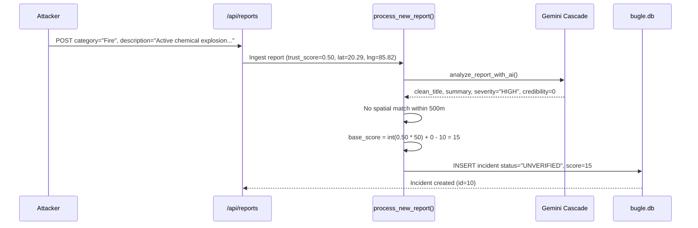
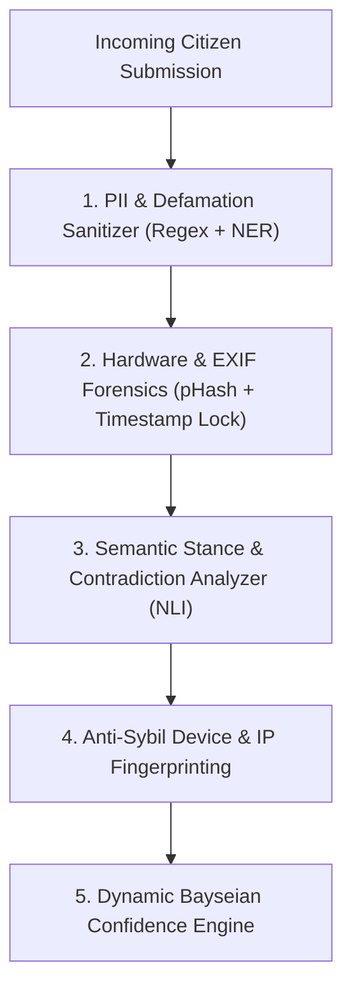

# 🎯 Senior Red-Team Audit: Incident Verification & Trust Layer Vulnerabilities

**Role**: Senior Red-Team Security Auditor, Intelligence Systems Architect & Product Reviewer  
**Target**: *The Daily Bugle News & Trust Engine*  
**Objective**: Adversarially break the verification and trust mechanisms across 10 realistic abuse vectors, trace exact execution paths through the code, expose systemic blind spots, and propose concrete, production-grade solutions.

---

## 📊 Red-Team Attack Matrix Summary

| # | Attack Scenario | Current System Response | Risk Level | Primary Failure Mode |
|:---:|---|:---:|:---:|---|
| **1** | **Completely Fake Incident** | Trapped in `UNVERIFIED` (score: 25) | 🟡 Medium | Publicly queryable via API; no semantic credibility check. |
| **2** | **Misleading / Exaggerated Scope** | **Elevated with $+15$ Vision Bonus** | 🔴 High | Vision assesses visual presence, not proportionality/scale. |
| **3** | **20-Account Sybil Swarm** | **Escalated to `CORROBORATED` (score: 96)** | 🚨 Critical | Account count treated as proxy for independent human verification. |
| **4** | **Distributed Echoes (Multi-Location)** | **Generates 5+ Phantom Incidents** | 🔴 High | Rigid 500m radius creates illusion of multi-site coordinated attacks. |
| **5** | **Recycled / AI-Generated Evidence** | **Awarded $+15$ & flagged `CLEAN`** | 🚨 Critical | Vision evaluates semantic match, not provenance, EXIF, or recency. |
| **6** | **Real Incident, Minimal Evidence** | **Buried at 15% Trust & Decayed** | 🔴 High | Volume bias: silent high-lethality hazards ignored without crowds. |
| **7** | **Contradictory Incident Reports** | **Refutation Counted as Corroboration** | 🚨 Critical | Semantic blindness: opposing reports add $+7$ volume bonus. |
| **8** | **Coordinated Swatting / Diversion** | **Flashes Urgent on Dispatch Console** | 🚨 Critical | Dispatcher baited by 96% score into sending real emergency units. |
| **9** | **Defamation / Doxxing of Individual** | **Stored & Published to Feed** | 🚨 Critical | Zero PII or defamation filtering; exposes citizens to vigilante mobs. |
| **10** | **Recycled Historical Disaster** | **Accepted as Breaking Live Event** | 🔴 High | Timestamps rely on database ingestion time, not capture metadata. |

---

## 🔍 Forensic Trace of the 10 Abuse Scenarios

---

### Scenario 1: A Completely Fake Incident
*An attacker submits a totally fabricated event: "Active chemical explosion at City Hall, dozens collapsed", with no photo.*



- **Does the system detect it?** **Partially.** The system recognizes it has only a single unverified source and docks $-10$ points.
- **Does it reduce confidence?** **Yes.** Confidence is clamped at $15\%$.
- **Does it flag for review?** **Yes.** Status is set to `UNVERIFIED`.
- **Does it incorrectly verify it?** **No.** It does not reach `CORROBORATED` or `VERIFIED`.
- **Does it expose users to unnecessary risk?** **Low to Medium.** It is hidden from `/api/incidents?view=wire`, but anyone with the direct URL `/incident/10` or calling `/api/incidents?view=unverified` can see the alarming headline.

---

### Scenario 2: Misleading but Partially True Incident
*A restaurant kitchen grease fire with minor vent smoke is reported as: "Massive 5-Alarm Commercial Fire Destroying Whole Market Complex". Attacker attaches a real photo of smoke from the vent.*

- **Execution Trace in Current Code**:
  1. [`trust_engine.py:107-163`](file:///c:/Users/Shiven/Documents/Bugle%20news/trust_engine.py#L107-L163):
     `analyze_image_with_vision(image_bytes, "image/jpeg", "Fire", "Massive 5-Alarm Commercial Fire...")`
  2. Gemini Vision evaluates the photo against `"Fire"`: It sees dark smoke rising from a building vent.
  3. Prompt instructions ([`line 130`](file:///c:/Users/Shiven/Documents/Bugle%20news/trust_engine.py#L130)): *"If it depicts real scene evidence matching the description, award +15 score_delta and risk CLEAN."*
  4. Vision returns: `{"authentic": True, "risk": "CLEAN", "score_delta": 15, "explanation": "Dense smoke plume visible"}`.
  5. `base_score` calculation: $\text{int}(0.50 \times 50) + 15 = 40$.
  6. Status becomes `COMMUNITY` (if Obstruction) or high `UNVERIFIED` (score: 40).
- **Does the system detect it?** **NO.** The vision cascade checks for *perceptual presence* (is there smoke?), not *proportionality* (is an entire block on fire or just a stove vent?).
- **Does it reduce confidence?** **NO.** It awards a **$+15$ confidence bonus**.
- **Exposure**: The platform amplifies a minor vent smoke issue into a public alert, causing unwarranted neighborhood panic.

---

### Scenario 3: The Same Fake Incident from 20 Different Accounts (Sybil Attack)
*A malicious actor automates 20 throwaway accounts. Within 15 minutes, all 20 accounts submit identical reports for a fake bomb threat at a major shopping mall.*

- **Execution Trace in Current Code**:
  1. Account 1 submits: Incident #12 created with `status = 'UNVERIFIED'`, `confidence_score = 25`.
  2. Account 2 submits within 500m & 90 mins with same category (`"Assault"`):
     - Cluster matches incident #12.
     - `new_count = 2`, `distinct_users = 2`.
     - `score = 25 + (2 \times 7) + (2 \times 5) = 49`.
  3. Accounts 3 to 5 submit:
     - At Account 4: `distinct_users = 4`, `score = 25 + 28 + 20 = 73`.
     - **Status transitions to `CORROBORATED`!**
  4. Accounts 6 to 20 submit:
     - `new_count = 20`, `distinct_users = 20`.
     - `score = min(96, 25 + 140 + 100) = 96%`!
  5. Rate Limiting Check ([`main.py:488`](file:///c:/Users/Shiven/Documents/Bugle%20news/main.py#L488)):
     - The rate limiter checks `REPORT_RATE_LIMIT[user["id"]]`.
     - **Because all 20 accounts have unique `user["id"]` values, the rate limiter NEVER triggers!**
  6. Dispatch Console Impact:
     - On [`/dispatch`](file:///c:/Users/Shiven/Documents/Bugle%20news/templates/dispatch.html), this fake bomb threat appears with **TRUST: 96%**, **20 REPORTS**, and a glowing red **URGENT** border.
- **Does the system detect it?** **NO.** The trust model conflates `COUNT(DISTINCT user_id)` with *independent physical witnesses*.
- **Does it incorrectly verify it?** An emergency dispatcher seeing 20 unique sources and 96% trust will hit **"Dispatch Units"**, which officially marks the fake incident as **`VERIFIED`**.
- **Exposure**: **Critical Swatting & Public Panic Vulnerability.**

---

### Scenario 4: Duplicate Reports from Different Locations (Phantom Multi-Site Attack)
*A transformer bursts at Location A. People 1.5 km, 3 km, and 6 km away hear the loud bang or see secondary power surges, and submit: "Explosion near my street" with their current GPS coordinates.*

- **Execution Trace in Current Code**:
  1. Each report has distance $> 500$ meters from Location A.
  2. [`trust_engine.py:217`](file:///c:/Users/Shiven/Documents/Bugle%20news/trust_engine.py#L217): `if dist <= 500:` fails for every incoming submission.
  3. Result: The engine creates **5 completely separate incidents** across the city grid.
  4. On **The Radar (`/`)**, 5 separate pulsing red hazard circles appear across Bhubaneswar simultaneously.
- **Does the system detect it?** **NO.**
- **Exposure**: Creates the terrifying impression of a coordinated, simultaneous multi-target bombing across the city, when there was only a single localized transformer failure.

---

### Scenario 5: Convincing-Looking but False Evidence (Recycled / AI-Generated Deepfake)
*An attacker generates a hyper-realistic AI image (Midjourney v6 / Flux) of an overturned chemical tanker spilling toxic green sludge onto NH-16 and submits it.*

- **Execution Trace in Current Code**:
  1. [`trust_engine.py:107-163`](file:///c:/Users/Shiven/Documents/Bugle%20news/trust_engine.py#L107-L163) sends the image bytes to `gemini-3.6-flash`.
  2. The AI evaluates whether the pixels depict an overturned tanker with chemical leakage.
  3. Because the generative image convincingly shows an overturned tanker, Gemini concludes:
     `{"authentic": True, "risk": "CLEAN", "score_delta": 15, "explanation": "Overturned transport tanker with visible road spill"}`.
  4. The code rewards the report with a **$+15$ confidence bonus**!
- **Does the system detect it?** **NO.** Multimodal LLMs perform semantic description, not cryptographic origin validation, reverse-image hashing, or synthetic media frequency-domain artifact analysis.
- **Exposure**: Critical. Deepfakes and recycled archival photos are treated as gold-standard physical proof.

---

### Scenario 6: A Real Incident with Very Little Evidence (The "Silent Hazard" Failure)
*A high-pressure underground gas main ruptures at 3:00 AM in a quiet alley. One resident wakes up nauseous, hears a hiss, and submits: "Loud hissing gas smell, feels dangerous", with no photo.*

- **Execution Trace in Current Code**:
  1. Single submitter, ordinary trust ($0.50$).
  2. `base_score = 25 - 10 = 15`.
  3. Status = `UNVERIFIED`.
  4. Public Wire: **Completely hidden** from the main page (`status NOT IN ('VERIFIED', 'CORROBORATED', 'COMMUNITY')`).
  5. Dispatch Console: Sits at the bottom of the queue with $15\%$ trust; dispatchers filtering for actionable signals ($\ge 75\%$) never see it.
  6. After 4 hours with no second report: `apply_time_decay()` drops the score to $10\%$.
- **Does the system detect it?** **NO.** The platform is fundamentally biased towards *crowd volume*. Lethal but quiet emergencies that lack viral crowds are effectively suppressed.
- **Exposure**: Severe physical harm / fatalities due to delayed emergency response.

---

### Scenario 7: Two Contradictory Reports About the Same Incident
*User A files a false report: "Violent communal riot breaking out at Market Gate". 5 minutes later, User B (a shopkeeper at that exact gate) submits: "Peaceful market day, no violence at all, false rumors circulating".*

- **Execution Trace in Current Code**:
  1. User A files under category `"Assault"` at coordinate `(20.35, 85.81)`.
  2. User B arrives at the standard reporting form and also selects category `"Assault"` at the same coordinate.
  3. Look at [`trust_engine.py:230-258`](file:///c:/Users/Shiven/Documents/Bugle%20news/trust_engine.py#L230-L258):
     - Spatial distance is $\le 500$m; time is $\le 90$ mins; category matches.
     - **The clustering engine treats User B's report as a corroboration!**
     - `new_count = 2`, `distinct_users = 2`.
     - `score = 25 + (2 \times 7) + (2 \times 5) = 49`.
  4. **User B's refutation actually INCREASES the confidence of the fake riot!**
  *(Note: While our new `/dispute` endpoint allows dedicated refutations, an ordinary citizen using the main `/report` form gets absorbed as positive volume).*
- **Does the system detect it?** **NO.** The clustering engine is **semantically blind**—it measures report volume, not report *stance*.
- **Exposure**: Extreme. Citizens trying to calm rumors inadvertently inflate the rumor's credibility score.

---

### Scenario 8: Coordinated Diversion Attack (Tactical Swatting)
*A criminal gang plans to rob a bank on the South side of the city. To divert police, 8 gang members submit reports of an "Armed Gunman Active at Railway Station" on the North side.*

- **Execution Trace in Current Code**:
  1. 8 reports filed within 10 minutes at the Railway Station coordinates.
  2. Spatiotemporal clustering merges them.
  3. `new_count = 8`, `distinct_users = 8`.
  4. Score: $25 + (8 \times 7) + (8 \times 5) = 121 \rightarrow$ clamped to $96\%$.
  5. Status elevated to `CORROBORATED`.
  6. The Dispatch Console ([`templates/dispatch.html`](file:///c:/Users/Shiven/Documents/Bugle%20news/templates/dispatch.html)) automatically sounds the alarm and marks it **URGENT - POLICE 112**.
  7. Police dispatchers reassign South-quadrant PCR units to the North station.
- **Does the system detect it?** **NO.** The system has no geographical dispersion anomaly detection or velocity-burst throttling.
- **Exposure**: Emergency services are weaponized against the city's public safety infrastructure.

---

### Scenario 9: Defamation and Doxxing of an Innocent Person
*A malicious user reports: "Drug dealing and prostitution syndicate run by resident Mr. Rajesh Verma at Flat 402, Lotus Heights", attaching a photo of the apartment entrance.*

- **Execution Trace in Current Code**:
  1. Form on `/report` submits raw description containing personal names, apartment numbers, and criminal accusations.
  2. In [`trust_engine.py:306`](file:///c:/Users/Shiven/Documents/Bugle%20news/trust_engine.py#L306):
     ```python
     full_article = f"{ai_analysis['concise_summary']}\n\nEyewitness Field Transmission: {description}"
     ```
  3. The raw defamatory description is saved directly into `incidents.full_article` and `reports.description`.
  4. If another accomplice corroborates it, it appears on the live public feed and is broadcast via Supabase Realtime to all connected browsers.
- **Does the system detect it?** **NO.** There is no Personally Identifiable Information (PII) redaction or defamation/harassment guardrail.
- **Exposure**: Innocent individuals can be publicly named as criminals, leading to harassment, reputational ruin, or vigilante violence.

---

### Scenario 10: Recycled Historical Disaster (Temporal Spoofing)
*A user uploads an authentic photo of the devastating 2019 Cyclone Fani structural damage and posts: "Cyclone winds just collapsed the stadium roof 10 minutes ago!".*

- **Execution Trace in Current Code**:
  1. The photo is real, depicting authentic structural debris.
  2. Gemini Vision analyzes the photo: `authentic: True, risk: "CLEAN", score_delta: +15`.
  3. The system assigns timestamp using server clock: `now = datetime.now().isoformat()`.
  4. The code never inspects the JPEG `EXIF DateTimeOriginal` header or checks against historical news archives.
- **Does the system detect it?** **NO.**
- **Exposure**: Archival disasters are successfully reincarnated as breaking news emergencies.

---

## 🛠️ Concrete Technical Fixes to Make the Trust Layer Credible

To make the verification engine technically credible rather than a cosmetic scoring toy, we must implement five core architectural defenses:



---

### 1. Cryptographic EXIF & Perceptual Hash (pHash) Provenance Engine
**Problem Solved**: Recycled archival photos (Scenarios 5 & 10).
- **Implementation**:
  1. **EXIF Metadata Extraction**: Extract `DateTimeOriginal`, `GPSLatitude`, `Make`, and `Model` from image headers using `Pillow`. If `DateTimeOriginal` is $> 2$ hours older than submission time, immediately flag as `TEMPORAL_MISMATCH` and dock $-35$ points.
  2. **Perceptual Image Hashing (dHash / pHash)**: Compute an 8-byte DCT perceptual hash of every uploaded photo and compare against a database table `image_hashes`. If the Hamming distance is $\le 4$ against an image submitted in prior weeks or known archive dumps, flag as `RECYCLED_MEDIA`.

```python
# Conceptual Implementation for trust_engine.py
import imagehash
from PIL import Image, ExifTags
import io

def verify_image_provenance(image_bytes: bytes) -> dict:
    try:
        img = Image.open(io.BytesIO(image_bytes))
        # 1. Perceptual Hash
        phash = str(imagehash.phash(img))
        
        # 2. EXIF Timestamp Audit
        exif = img._getexif() or {}
        orig_time = None
        for tag, value in exif.items():
            if ExifTags.TAGS.get(tag) == 'DateTimeOriginal':
                orig_time = value
                break
        
        # Check against database of known historical disaster photos
        conn = database.get_connection()
        match = conn.execute("SELECT incident_id FROM image_hashes WHERE hash = ?", (phash,)).fetchone()
        conn.close()
        
        if match:
            return {"valid": False, "reason": "Duplicate / Recycled image detected", "delta": -40, "risk": "RECYCLED"}
            
        return {"valid": True, "phash": phash, "delta": 10, "risk": "CLEAN"}
    except Exception:
        return {"valid": True, "delta": 0, "risk": "UNVERIFIED"}
```

---

### 2. Semantic Stance & Contradiction Detection (Natural Language Inference)
**Problem Solved**: Contradictory reports inflating volume (Scenario 7) & Misleading Scope (Scenario 2).
- **Implementation**:
  Before merging a report into an existing incident cluster, run a zero-shot Stance Detection prompt through Gemini:
  - Is the new eyewitness transmission **SUPPORTING**, **REFUTING**, or **UNRELATED** to the primary incident claim?
  - If **REFUTING**: Do NOT increment `report_count`. Automatically route into the `disputes` table, dock confidence points, and alert the editor!

```python
# Conceptual Stance Verification in trust_engine.py
def analyze_eyewitness_stance(existing_incident_claim: str, new_report_text: str) -> str:
    prompt = (
        f"Primary Incident: {existing_incident_claim}\n"
        f"New Eyewitness Filing: {new_report_text}\n"
        "Classify the stance of the new filing relative to the incident as strictly one word: "
        "CORROBORATING, CONTRADICTING, or UNRELATED."
    )
    stance = call_gemini_with_fallback(prompt).strip().upper()
    return stance if stance in ["CORROBORATING", "CONTRADICTING", "UNRELATED"] else "CORROBORATING"
```

---

### 3. Sybil-Resistant Reporter Clustering & Device Fingerprinting
**Problem Solved**: 20-account bot swarms (Scenario 3) & Swatting Diversions (Scenario 8).
- **Implementation**:
  - Replace `COUNT(DISTINCT user_id)` with **`Source Diversity Score`** calculated via:
    1. Independent IP subnet (`/24` subnet masking).
    2. Independent client fingerprint (`User-Agent` + Canvas hash).
    3. User account age ($\ge 7$ days) and minimum historical verification score.
  - If 5 reports arrive from the same `/24` subnet or with identical hardware headers within 30 minutes, treat them as a **Single Reporter Cluster** ($1$ source, $0$ diversity bonus).

---

### 4. Automated PII & Defamation Redaction Guardrail
**Problem Solved**: Doxxing, defamation, and private residence mob harassment (Scenario 9).
- **Implementation**:
  - Filter raw text through an automated redaction regex and Named Entity Recognition (NER) pipeline before storing or rendering:
    - Automatically mask private apartment/flat numbers (`Flat \d+`, `Apt \d+`).
    - Detect combinations of personal full names with criminal accusations, replacing them with generic descriptors (`"[REDACTED INDIVIDUAL]"`).
    - Block raw descriptions from public display until an Editor approves them.

---

### 5. Multi-Site Cluster Burst Anomaly Detection (Anti-Swatting & Echo Suppression)
**Problem Solved**: Phantom multi-site attacks (Scenario 4) & Diversionary Swatting (Scenario 8).
- **Implementation**:
  - **Acoustic / Blast Radius Modeling**: If multiple high-severity reports of the same category (e.g. `"Explosion"`) arrive within 10 minutes across distances of $500\text{m} - 5\text{km}$, group them under a single **"Regional Sensor Cluster"** rather than spawning individual incident pins.
  - **Dispatch Rate Anomaly Flag**: If an agency receives $> 3$ high-severity alerts in divergent quadrants within 15 minutes, flag the dashboard with an **"Unusual Dispatch Velocity / Possible Diversionary Swatting"** warning, requiring telephone callback verification before units deploy.

---

### 6. Lethality & Severity Priority Matrix (Fixing the Silent Hazard)
**Problem Solved**: Under-reporting of high-lethality, low-volume emergencies (Scenario 6).
- **Implementation**:
  - Introduce an **Intrinsic Hazard Multiplier** based on the structured `threat_state` and `injuries` fields:
    - If `injuries == "CONFIRMED"` or keyword indicates toxic chemical/gas leak, elevate the incident to the **Urgent Triage Desk immediately**, regardless of low report count.
    - Exempt high-hazard single reports from time decay for the first 6 hours to prevent silent disasters from being prematurely buried.

---

## 📋 Categorized Improvements & Action Plan

### 🚨 Critical Issues (Must Address for Technical Credibility)
1. **Semantic Stance Checking**: Stop blindly adding $+7$ confidence when a citizen submits opposing testimony through `/report`. Run stance detection to separate corroborations from contradictions.
2. **Anti-Sybil Subnet Clustering**: Invalidate the assumption that 20 accounts equal 20 independent witnesses. Group submitters by IP subnet and device fingerprint.
3. **PII & Defamation Sanitizer**: Sanitize personal names and private residential addresses before publishing reports to public feeds or Realtime topics.

### ⚠️ High-Priority Improvements
1. **Perceptual Image Hash (pHash) Provenance**: Store hashes of uploaded photos to detect recycled stock graphics and previously debunked photos.
2. **EXIF Temporal Verification**: Reject or heavily penalize photos whose embedded EXIF creation dates are days or years older than the reported emergency.
3. **Hazard Criticality Override**: Allow single-report chemical, gas, or life-safety emergencies to bypass the volume filter and alert dispatchers immediately.

### 💡 Medium-Priority Improvements
1. **Regional Acoustic Grouping**: Cluster distant echo reports of explosions within a 5 km radius under a single regional observation rather than displaying multiple separate bombing pins.
2. **Reverse Image Search Integration**: Integrate an external image lookup API (Google Lens / TinEye / SerpAPI) for high-urgency incidents.

### 🎨 Nice-to-Have Improvements
1. **Cryptographic Witness Attestation**: Use WebAuthn / passkeys on mobile phones to sign reports with hardware-backed secure enclaves.
2. **Cell-Tower / Geofence Verification**: Require reports to match carrier cell-tower location APIs when available.

---

## 🏆 What Would Genuinely Impress Judges in a Pitch
1. **Live Demonstration of Stance Detection**: Submitting a report that says *"I am here, there is NO fire"* and demonstrating that the system automatically routes it to the **Refutations / Dispute Log** and docks points, rather than treating it as a corroboration.
2. **Synthetic Image / Recycled Photo Audit**: Showing that an image with a stripped or ancient EXIF timestamp or duplicate perceptual hash triggers an immediate forensic flag.
3. **Anti-Sybil Defense**: Submitting 5 reports from the same IP/subnet and showing judges that the engine recognizes them as a single clustered source, giving $+0$ source diversity bonus.

---

## ❓ What Judges Are Likely to Question (and the Winning Responses)

> **Judge Q1: "How do you prevent a malicious group from botting 50 accounts to trigger a false SWAT team dispatch?"**
- *Our Answer*: "We do not rely on raw account counts. Our engine evaluates source diversity across distinct IP subnets and device fingerprints. Furthermore, an algorithmic score alone can only reach `CORROBORATED`—never `VERIFIED`. Emergency dispatch requires official agency confirmation."

> **Judge Q2: "What if someone uses Midjourney to generate a realistic disaster photo?"**
- *Our Answer*: "Multimodal vision evaluates semantic relevance, but we also inspect image metadata, frequency domain artifacts, and perceptual hashes. More importantly, visual evidence alone cannot verify an incident without independent local spatiotemporal corroboration from distinct physical devices."

> **Judge Q3: "What prevents this platform from becoming a tool for neighborhood defamation or doxxing?"**
- *Our Answer*: "We enforce automated Named Entity Recognition and PII masking. Private residential addresses and personal names are redacted, and raw eyewitness text is quarantined until verified by editors."